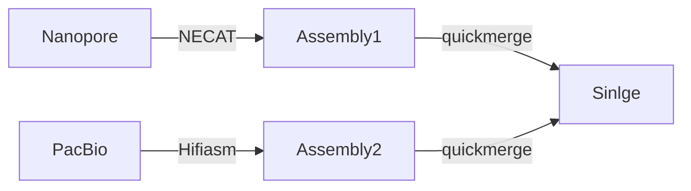

Related Papers:
- Rayamajhi N, Cheng C H C, Catchen J M. Evaluating Illumina-, Nanopore-, and PacBio-based genome assembly strategies with the bald notothen, Trematomus borchgrevinki[J]. G3, 2022, 12(11): jkac192. [Paper](https://academic.oup.com/g3journal/article/12/11/jkac192/6651842)
- van Rengs W M J, Schmidt M H W, Effgen S, et al. A chromosome scale tomato genome built from complementary PacBio and Nanopore sequences alone reveals extensive linkage drag during breeding[J]. The Plant Journal, 2022, 110(2): 572-588. [Paper](https://onlinelibrary.wiley.com/doi/full/10.1111/tpj.15690) 
- Murigneux V, Rai S K, Furtado A, et al. Comparison of long-read methods for sequencing and assembly of a plant genome[J]. GigaScience, 2020, 9(12): giaa146. [Paper](https://academic.oup.com/gigascience/article/9/12/giaa146/6042729)

## Evaluating Illumina-, Nanopore-, and PacBio-based genome assembly strategies with the bald notothen, Trematomus borchgrevinki

|||
|:-|:-:|
|In this paper, they did long reads assembly and Long-reads, short-reads hybrid assembly comparing. The experiment organism is "Trematomus borchgrevinki" (**fish**), a cold specialized Antarctic notothenioid fish with an estimated genome size of 1.28 Gb| [© Gregory Sloop](https://www.researchgate.net/publication/364608485_The_Cardiovascular_System_of_Antarctic_Icefish_Appears_to_Have_Been_Designed_to_Utilize_Hemoglobinless_Blood?_tp=eyJjb250ZXh0Ijp7ImZpcnN0UGFnZSI6Il9kaXJlY3QiLCJwYWdlIjoiX2RpcmVjdCJ9fQ)|

Sequencing Size: 
- Nanopore: 24.29 Gb 
- PacBio: 118.42 Gb

**Hybrid** assemblies can generate ==higher contiguity== they tend to suffer from lower quality. **long-read-only assemblies** can be optimized for ==contiguity== by subsampling length-restricted raw reads. Long-read contig assembly is the current **best choice** and that assemblies from phase I and phase II were of lower quality.

Strategies:
- Long-reads and short-reads hybrid: quickmerge
    1. Long-reads assembly independently: `Canu` and `WTDBG2` assembly, assessed with `QUAST`
    2. 2 rounds of polishing with `Pilon`. (First round: SNPs adn indels, Second round: local reassembly)
    3. Gap filling with `PBJELLY`
- Long-reads only was assembly by variaties of tools. The yacrd (Marijon et al. 2020) it the tool to identify potential **chimeric reads**
    1. `WTDBG2` was used to do the assembly

For long-reads, comparing to short-reads assembled genome, it has high continuity but also more number of duplicated BUSCO genes. Chimeric reads are exist. In this paper, they also applied the subsampling to deleted chimeric reads. By cooperate with the limiting reads lengths, the PacBio reads assembly results could be improved. The number of contigs dropped from 10,848 to 4,409 with only 70 Gb of data (generated by sampling minimum and maximum read lengths of 10 and 40 kb)

In this paper, the data shows that the assembly results from ONT reads are not as good as those from PacBio reads. However, because they used very different methods for pre-processing reads and assembly, the results are somewhat incomparable. Therefore, we can only conclude that the PacBio pipeline is more advanced.

## Comparison of long-read methods for sequencing and assembly of a plant genome

|||
|:-|:-:|
|This paper targets ***Macadamia jansenii***, a type of tree. The PacBio data surprised others because it has higher coverage and longer reads than the typical ONT data. Therefore, **cross-comparison is meaningless**. However, they assembled the genome using **multiple tools**, so the **internal data-type comparison** is still valuable.|[© Ian Edwin Cock](https://www.researchgate.net/publication/264458556_Evaluation_of_the_potential_of_Macadamia_integriflora_extracts_as_antibacterial_food_agents?_tp=eyJjb250ZXh0Ijp7ImZpcnN0UGFnZSI6Il9kaXJlY3QiLCJwYWdlIjoiX2RpcmVjdCJ9fQ)|

| Category           | ONT             | PacBio          | BGI                       |
|--------------------|-----------------|-----------------|---------------------------|
| **Mean Reads Length** | 7,962           | 20,575          | 2 × 100                   |
| **Assembly**       | Redbean v2.5, Flye v2.5, and Canu | Redbean v2.5, Flye v2.5, and Canu | SuperPlus v1.0, Supernova v2.1.1, TGS-GapCloser |
| **Data Size**      | 24.9 Gb         | 65.2 Gb         | 74.5 Gb                   |
| **Largest Contigs**| 9,683,794       | 23,824,472      | 517,998                   |
| **Contigs**        | 6,022           | 5,717           | 19,954                    |
| **N50 (M)**        | 1.59            | 2.10            | 39.47                     |

Hybrid assembly:
1. MaSuRCA v3.3.3: Illumina + ONT/PacBio
2. Flye v2.5 to perform the final assembly

Diploid de novo genome assembly: PacBio reads was performed with FALCON v1.3.0

Assembly Evaluation: QUAST v5.0.2;  publicly available reference genome of M. integrifolia v2 (Genbank accession: GCA_900631585.1); subjected to BUSCO v3.0.2 with the eudicotyledons_odb10 database (2,121 genes).

In this result, the PacBio sequences dominate everything. This is because ultra-long ONT reads were not used here. Consequently, not only the length of the reads but also the accuracy and coverage of the ONT reads are lower than those of the PacBio. This comparison is extremely uneven. By **comparing different long-reads assembly tools** (Redbean, Flye, Falcon, Canu, Raven), the ==Rave== is the best for both PacBio and ONT data. An interesting thing is, according to the paper, Rave supports the GPU-accelerate. But in this research, they only given 12 threads for Rave though, technically, we could give more than 1,000 of threads if we have a professional GPU.

## A chromosome scale tomato genome built from complementary PacBio and Nanopore sequences alone reveals extensive linkage drag during breeding

|||
|:-|:-:|
|In this research, they target into the cultivated **tomato** (Solanum lycopersicum). They applied PacBio HiFi and ONT Nanopore sequencing to develop **independent**. After then, they **merged the HiFi and ONT assemblies** to generate a long-read-only assembly where all 12 chromosomes were represented as 12 contiguous sequences (N50 = 68.5 Mbp).| [© Gbenga Emmanuel Orunmolase](https://www.researchgate.net/publication/371350058_MICROORGANISMS_ASSOCIATED_WITH_SOFT_ROT_OF_TOMATOES?_tp=eyJjb250ZXh0Ijp7ImZpcnN0UGFnZSI6Il9kaXJlY3QiLCJwYWdlIjoiX2RpcmVjdCJ9fQ)|

|                       | ONT                 | PacBio HiFi              |
|-----------------------|---------------------|--------------------------|
| **Data Size**         | 100~ Gb (x2)        | 20~ Gb (x2)              |
| **Assembled Contigs** | 100~300             | 700~2000                 |
| **Computational Costs** | 3 days with 256 threads (NECAT) | 2 hours with 128 threads (Hifiasm) |

Although the **ONT has fewer contigs**, it has a lower BUSCO (complete) percentage due to uncorrectable base errors. For the ==saturating test==, they found that for PacBio HiFi reads, **20 Gb** would be enough to finish a good assembly with **Hifiasm**. For longer ONT reads, **50 Gb** could do a similar job with **NECAT**. After that, they conducted the ==merge test== because they found partial complementarity of the assemblies as the breakpoints were different. After merging the two results, they obtained 12 super contigs, which correspond to the 12 chromosomes. Along with these 12 super contigs, they also obtained 54 contigs that could not be assembled into the 12 chromosomes; these could be chloroplast, mitochondrial, rDNA, and satellite repeat-derived sequences.

### MbTMV assembly pipeline (Merge ONT and PacBio results)

1. Assembly result polishing
2. nucmer (part of mummer v.4.0.0rc1) with the -l parameter to prevent invalid contig links
3. quickmerge[^quickmerge] was used to merge 2 assemblies with the parameter -c 7.0.

[^quickmerge]: Chakraborty M, Baldwin-Brown J G, Long A D, et al. Contiguous and accurate de novo assembly of metazoan genomes with modest long read coverage[J]. Nucleic acids research, 2016, 44(19): e147-e147. [GitHub](https://github.com/mahulchak/quickmerge)

A very interesting thing is they use a customized script to convert the Salsa2 output to Hi-C file and plot the contact plot with jucibox

---
A recent comparison pointed out that PacBio HiFi reads tend to lead to better assembly of the barley (Hordeum vulgare) genome than ONT (Mascher et al., 2021)

